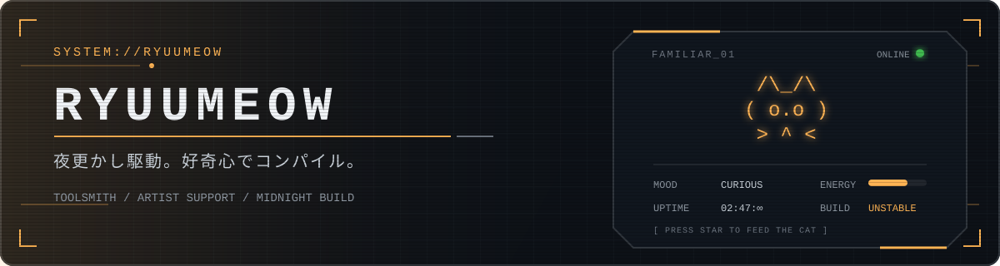

<p align="center">
  
</p>

<p align="center">
  <a href="https://github.com/RyuuMeow?tab=followers"></a>
  
  
</p>

```console
ryuu@midnight:~$ boot profile.sys
[ OK ] curiosity daemon is running
[ OK ] drawing tools mounted
[WARN] spaghetti code detected — shipping anyway
```

<table>
  <tr>
    <td width="50%" valign="top">
      <h3>PLAYER DATA // 玩家資料</h3>
      <p>
        <code>CLASS</code> Toolsmith / 繪師支援<br>
        <code>HABITAT</code> Windows · Unity · Unreal · Terminal<br>
        <code>TRAIT</code> 把「應該要有吧？」做成真的<br>
        <code>ACTIVE</code> 偶爾放些有的沒的在這邊
      </p>
    </td>
    <td width="50%" valign="top">
      <h3>QUEST LOG // 目前任務</h3>
      <p>
        <code>01</code> 讓畫畫少幾個多餘步驟<br>
        <code>02</code> 把重複操作塞進快捷鍵<br>
        <code>03</code> 做一些自己真的會用的怪工具<br>
        <code>∞</code> 深夜修掉「最後一個 bug」
      </p>
    </td>
  </tr>
</table>

<h2 align="center">⌁ LOADOUT // 裝備欄 ⌁</h2>

<p align="center">
  
</p>

<p align="center">
  <code>DESKTOP TOOLS</code>　×　<code>ARTIST WORKFLOWS</code>　×　<code>GAME DEV</code>　×　<code>QUESTIONABLE AUTOMATION</code>
</p>

<h2 align="center">⌁ FEATURED DROPS // 精選掉落物 ⌁</h2>

<table>
  <tr>
    <td width="50%" valign="top">
      <h3><a href="https://github.com/RyuuMeow/GoPieMenu">◈ GoPieMenu</a></h3>
      <p>Windows 放射狀快捷選單。從游標位置叫出來，不用把手移離畫布；可依應用程式切換配置。</p>
      <p><code>C++</code> <code>Qt</code> <code>Windows</code></p>
      
    </td>
    <td width="50%" valign="top">
      <h3><a href="https://github.com/RyuuMeow/ColorScope">◈ ColorScope</a></h3>
      <p>給繪師用的色彩分析工具：取色、色相隔離、飽和度熱力圖、調整圖層與色版生成器。</p>
      <p><code>COLOR</code> <code>ART TOOL</code> <a href="https://ryuumeow.github.io/ColorScope/">PLAY ONLINE ↗</a></p>
      
    </td>
  </tr>
  <tr>
    <td width="50%" valign="top">
      <h3><a href="https://github.com/RyuuMeow/NeverThinkAutoReply">◈ NeverThinkAutoReply</a></h3>
      <p>反白文字後用快捷鍵召喚 AI 回覆。內建正常、反駁、嘲諷與 MyGO / Ave Mujica 梗圖模式，也能 OCR 圖片後以圖攻圖。</p>
      <p><code>AI</code> <code>OCR</code> <code>MEME WEAPON</code></p>
      
    </td>
    <td width="50%" valign="top">
      <h3><a href="https://github.com/RyuuMeow/MaidWhisper">◈ MaidWhisper</a></h3>
      <p>系統級 AI 朗讀軟體。用快捷鍵隨時開啟閱讀面板，支援 GPT-SoVITS 即時語音、自訂角色與多角色管理。</p>
      <p><code>TTS</code> <code>GPT-SoVITS</code> <code>MAID MODULE</code></p>
      
    </td>
  </tr>
</table>

<h2 align="center">⌁ ARCHIVE // 完整收藏櫃 ⌁</h2>

<details open>
<summary><b>🎨 ARTIST TOOLCHAIN // 繪師工具鏈</b></summary>
<br>

| FILE | TYPE | DESCRIPTION |
|:--|:--:|:--|
| [csp-toolkit](https://github.com/RyuuMeow/csp-toolkit) | `INDEX` | Clip Studio Paint 工具索引，收錄自製與值得收藏的第三方工具。 |
| [ColorScope](https://github.com/RyuuMeow/ColorScope) | `APP` | 取色、色相隔離、飽和度熱力圖與調整圖層。 |
| [ClipStudioPaint-Grayscale-Viewer](https://github.com/RyuuMeow/ClipStudioPaint-Grayscale-Viewer) | `OVERLAY` | 疊在 CSP 上的灰階預覽浮層，一鍵切換，不必建立顏色圖層。 |
| [GoPieMenu](https://github.com/RyuuMeow/GoPieMenu) | `UTILITY` | 依應用程式切換的 Windows 放射狀快捷選單。 |

</details>

<details open>
<summary><b>⚙️ ODD UTILITIES // 奇怪但有用</b></summary>
<br>

| FILE | TYPE | DESCRIPTION |
|:--|:--:|:--|
| [NeverThinkAutoReply](https://github.com/RyuuMeow/NeverThinkAutoReply) | `AI` | 快捷鍵生成回覆、OCR 圖片與梗圖反擊。 |
| [CLI-Eh-Downloader](https://github.com/RyuuMeow/CLI-Eh-Downloader) | `CLI` | E-Hentai / ExHentai 互動式批次下載器，整合種子與關鍵字過濾。 |
| [MaidWhisper](https://github.com/RyuuMeow/MaidWhisper) | `VOICE` | GPT-SoVITS 系統級朗讀面板與多角色語音管理。 |
| [WurtheringWave_Analyzer](https://github.com/RyuuMeow/WurtheringWave_Analyzer) | `LEGACY` | 鳴潮抽卡分析工具，已停止維護。 |

</details>

<details>
<summary><b>🐍 PACKAGES & PROMPTS // 套件與咒文書</b></summary>
<br>

| FILE | TYPE | DESCRIPTION |
|:--|:--:|:--|
| [SimpleProfileCard](https://github.com/RyuuMeow/SimpleProfileCard) | `PYPI` | 幾行 Python 生成個人名片網頁，能從 GitHub、YouTube、Reddit 抓取資料。<br><code>pip install profilecard</code> |
| [UE5-CPP-Doc-Searcher-Prompt](https://github.com/RyuuMeow/UE5-CPP-Doc-Searcher-Prompt) | `PROMPT` | 寫 UE5 C++ 時快速查文件的 Prompt 模板。 |
| [Alice-PERSONA-md](https://github.com/RyuuMeow/Alice-PERSONA-md) | `PERSONA` | 女僕 Alice 的 AI 人設檔，載入後即可使用。 |
| [Gemini-Music-Generation_Prompt](https://github.com/RyuuMeow/Gemini-Music-Generation_Prompt) | `PROMPT` | 用簡單描述生成音樂，並主動釐清風格的 Gemini System Prompt。 |

</details>

<h2 align="center">⌁ TELEMETRY // 遙測資料 ⌁</h2>

<p align="center">
  
  
</p>

<details>
<summary><b>OPEN EXTENDED TELEMETRY // 展開更多數據</b></summary>
<br>

<p align="center">
  
</p>

<p align="center">
  
</p>

<p align="center">
  
</p>

</details>

<p align="center">
  
</p>

<details>
<summary><b>☕ SUPPORT TERMINAL // 投餵能源</b></summary>
<br>

<p align="center">如果這些工具剛好幫你省下一點時間，可以請深夜開發者喝杯虛擬咖啡。</p>

<table>
  <tr>
    <td align="center" width="50%">
      <b>USDT // TRC-20</b><br><br>
      <br>
      <code>TXmghw1R9QaQSKGWEWP9ydr1xj8G1MqHrL</code>
    </td>
    <td align="center" width="50%">
      <b>ETH // ERC-20</b><br><br>
      <br>
      <code>0xe7b06b924cb4b922585a4ccd665cd2c3d0e02c</code>
    </td>
  </tr>
</table>

</details>

<br>

<p align="center">
  <code>END OF FILE</code><br>
  <sub>夜更かし駆動。好奇心でコンパイル。</sub>
</p>
